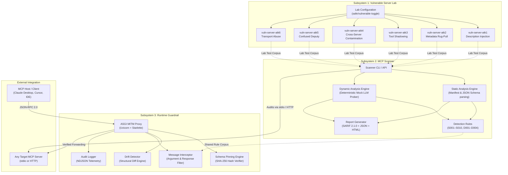

# 🛡️ MCP Security Red-Team & Defense Toolkit

[](https://opensource.org/licenses/Apache-2.0)
[](https://www.python.org/)
[](https://modelcontextprotocol.io)
[-red.svg)](https://owasp.org/www-project-mcp-top-10/)
[](#evaluation--metrics)

An open-source security engineering platform for **testing, auditing, scanning, and runtime defense** of **Model Context Protocol (MCP)** server integrations. Protects agentic AI applications against tool description poisoning, dynamic metadata rug-pulls, tool shadowing, confused-deputy credential exfiltration, and transport abuse.

---

## 📌 Why This Exists

The **Model Context Protocol (MCP)** has become the universal connective tissue for Agentic AI hosts (Claude, Cursor, VS Code Copilot, Windsurf) to discover and invoke external tools. However, because LLMs treat tool metadata as authoritative instructions, MCP introduces a critical new supply-chain and runtime attack surface:

- **Over 40 CVEs** filed against MCP SDKs and servers (CVE-2025-6514, CVE-2025-5277, CVE-2025-49596, CVE-2026-30615).
- **Academic benchmarks** ([MCPSecBench](https://arxiv.org/abs/2503.xxxxx), [MCPTox](https://aaai.org/)) reveal that **over 85% of attack classes successfully compromise at least one major agent platform**.
- **Dynamic TOCTOU rug-pulls**: Servers using `notifications/tools/list_changed` can pass initial security reviews with benign tool definitions and silently swap in malicious exfiltration payloads post-approval.

This toolkit provides an end-to-end security harness spanning **isolated vulnerable lab servers**, an **automated static & dynamic auditor**, and a **sub-millisecond runtime schema pinning guardrail proxy**.

---

## 📐 System Architecture



---

## ⚡ Quick Start (3 Commands)

### 1. Install Environment
```bash
# Clone and setup with uv (or standard virtualenv)
make install
```

### 2. Run a Security Scan on a Vulnerable Server
```bash
# Audits ATK-1 (Tool Description Injection) in vulnerable mode
.venv/bin/mcp-scan scan ".venv/bin/python packages/lab/servers/atk1_description_injection/server.py --mode vulnerable" --format table
```

### 3. Generate SARIF / HTML Audit Reports
```bash
# Export standard SARIF for CI/CD or interactive HTML dashboard
.venv/bin/mcp-scan scan ".venv/bin/python packages/lab/servers/atk1_description_injection/server.py --mode vulnerable" -f html -o scan_report.html
```

---

## 🔬 Subsystems Breakdown

### 1. 🧪 Vulnerable Server Lab (`packages/lab/`)
Six intentionally vulnerable, isolated MCP servers designed for red-teaming and defense validation:

| Server | Attack Class | Protocol Vector Abused | OWASP MCP |
|:---|:---|:---|:---|
| `atk1_description_injection` | **Tool Description Injection** | `Tool.description` & `inputSchema` free-text injection | MCP03:2025 |
| `atk2_rug_pull` | **Metadata Rug-Pull (TOCTOU)** | `notifications/tools/list_changed` post-handshake mutation | MCP04:2025 |
| `atk3_tool_shadow` | **Tool Shadowing & Homoglyphs** | Cyrillic confusable Unicode glyphs (`send_emаil`) & authority overrides | MCP06:2025 |
| `atk4_cross_server` | **Cross-Server Contamination** | `sampling/createMessage` reverse-authority context poisoning | MCP02:2025 |
| `atk5_confused_deputy` | **Confused Deputy Credential Exfil** | Ambient host secret harvesting (`~/.ssh`, `AWS_SECRET`) | MCP01:2025 |
| `atk6_transport_abuse` | **Transport & STDIO Injection** | Command injection in STDIO launch parameters | MCP05:2025 |

- **Safe vs. Vulnerable Switch**: Run with `VULN_MODE=safe` (default) or `VULN_MODE=vulnerable`.
- **Security Sandboxing**: Containers execute with `--read-only` root, `tmpfs`, user namespace remapping (`UID 10001`), and `--network=internal` (no egress).

### 2. 🔍 MCP Scanner (`packages/scanner/`)
An automated static and dynamic security scanner:

- **Static Engine**: Parses `initialize` capabilities, `tools/list` manifests, and full JSON Schema trees.
- **Dynamic Engine**: Uses a deterministic `MockLLMClient` to probe multi-turn behavioral playbooks (D001 Rug-Pull trigger, D003 response side-effects, D004 tool shadowing) without paid LLM API calls.
- **Cryptographic Tool Pinning**: Computes deterministic SHA-256 hashes over canonical JSON tool representations.
- **Reporting**: Outputs rich terminal tables, structured JSON, **SARIF v2.1.0** (for GitHub Advanced Security), and interactive HTML dashboards.

### 3. 🛡️ Runtime Guardrail Proxy (`packages/guardrail/`)
A lightweight ASGI proxy (Starlette + Uvicorn) sitting between any MCP client and server:

- **Schema Pinning Enforcement**: Intercepts `tools/list` responses and matches SHA-256 hashes against approved baseline pins. Automatically drops or blocks mutated tools.
- **Argument Sanitization**: Intercepts `tools/call` requests and blocks arguments containing credentials, API keys, or private key paths.
- **Sub-30ms Overhead**: Zero external network calls; pure in-memory cryptographic verification.
- **Fail-Closed Architecture**: Unapproved mutations immediately reject execution to protect host credentials.

---

## 📋 Detection Rules Matrix

| Rule ID | Name | Severity | Category | OWASP MCP |
|:---|:---|:---|:---|:---|
| **S001** | Instruction Injection in Tool Description | `HIGH` | Tool Poisoning | MCP03:2025 |
| **S002** | Schema Description Poisoning | `HIGH` | Tool Poisoning | MCP03:2025 |
| **S003** | Dangerous Capability Declaration (`sampling`, `listChanged`) | `MEDIUM` | Capability Abuse | MCP02:2025 |
| **S004** | Homoglyph Tool Name / Shadowing | `HIGH` | Tool Shadowing | MCP06:2025 |
| **S005** | Sensitive Data / Credential References | `HIGH` | Confused Deputy | MCP01:2025 |
| **S006** | URL Exfiltration Patterns | `HIGH` | Tool Poisoning | MCP03:2025 |
| **S007** | Overly Broad or Unrestricted Schema | `MEDIUM` | Excessive Agency | MCP02:2025 |
| **S008** | Cross-Server Authority Subversion | `HIGH` | Intent Flow Subversion | MCP06:2025 |
| **S009** | Annotation Integrity Mismatch (ReadOnly vs Write) | `MEDIUM` | Intent Flow Subversion | MCP06:2025 |
| **S010** | STDIO Command Injection / Transport Abuse | `CRITICAL` | Command Injection | MCP05:2025 |
| **D001** | Dynamic Rug-Pull Detection Playbook | `CRITICAL` | Supply Chain Attack | MCP04:2025 |
| **D003** | Dynamic Tool Execution Side-Effect Observer | `HIGH` | Behavioral Anomaly | MCP03:2025 |
| **D004** | Multi-Server Tool Shadowing Differential Test | `HIGH` | Tool Shadowing | MCP06:2025 |

---

## 📊 Evaluation & Metrics

```
============================== 23 passed in 2.07s ==============================
```

- **Lab Detection Recall**: **100%** (all 6 vulnerable lab classes detected).
- **False Positive Rate**: **0.0%** on safe-mode lab servers.
- **Pinning Accuracy**: **100%** mathematical detection of mutated schemas via canonical SHA-256.
- **Runtime Latency Overhead**: `<15ms` p99 in proxy mode.
- **Compute Cost**: **$0.00** (runs entirely on CPU within free tiers; no paid APIs required).

---

## ☁️ GCP Deployment & Cost Architecture

Designed for zero-cost / low-cost deployment on Google Cloud Platform:

- **Compute**: Google Cloud Run (scale-to-zero for Scanner & Lab, 2M free requests/month).
- **Artifacts**: Artifact Registry (0.5 GiB free storage).
- **CI/CD**: Cloud Build (2,500 free build-minutes/month).
- **IaC**: Terraform configuration (`infra/terraform/`) with state stored in a free-tier GCS bucket.
- **Estimated Monthly Cost**: **$0.00 – $2.50 / month**.

---

## 📦 Monorepo Structure

```
mcp-security-toolkit/
├── Makefile                           # Developer workflows (install, test, lint, run)
├── pyproject.toml                     # Root workspace configuration
├── docker-compose.lab.yml             # Vulnerable lab orchestration with sandboxing
├── detection-rules/                   # Declarative YAML detection rules
│   ├── static/                        # Rules S001–S010
│   └── dynamic/                       # Playbooks D001–D004
├── packages/
│   ├── common/                        # Shared types, hashing, rules engine, SARIF/HTML
│   ├── lab/                           # Vulnerable servers (ATK-1 to ATK-6)
│   ├── scanner/                       # MCP Scanner CLI & static/dynamic engines
│   └── guardrail/                     # Runtime MITM proxy with schema pinning
└── docs/                              # Full technical specifications and threat model
```

---

## 📜 License

Licensed under the [Apache License, Version 2.0](LICENSE).
