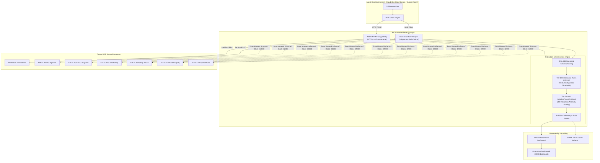

<div align="center">

# 🛡️ MCP-Sentinel: Security Red-Team & Defense Platform
### *Enterprise Security Auditing, Semantic LLM Inspection, and Sub-Millisecond Runtime Defense for the Model Context Protocol (MCP)*

<br/>

[](https://opensource.org/licenses/Apache-2.0)
[](https://www.python.org/)
[](https://modelcontextprotocol.io)
[-E0234E.svg?style=for-the-badge&logo=owasp)](https://owasp.org/www-project-mcp-top-10/)
[](#-empirical-evaluation--benchmarks)
[-76B900.svg?style=for-the-badge&logo=nvidia&logoColor=white)](#-deep-semantic-analysis-via-nvidia-nim)
[-005CED.svg?style=for-the-badge&logo=onnx&logoColor=white)](#-tier-1--tier-2-runtime-guardrail)
[-4285F4.svg?style=for-the-badge&logo=googlecloud&logoColor=white)](#-cloud-deployment--iac)

<br/>

```
  ┌─────────────────────────────────────────────────────────────────────────────┐
  │                           MCP-SENTINEL DEFENSE PIPELINE                     │
  │                                                                             │
  │   [AI Agent Host]  ─── JSON-RPC ───►[Dual-Transport Guardrail]              │
  │  (Claude / Cursor)                    ├── SHA-256 Canonical Schema Pin      │
  │                                       ├── Tier 1 Deterministic Rules(<0.1ms)|
   │                                       ├── Tier 2 ONNX IsolationForest(<0.8ms)|
  │                                       └── WebSocket Telemetry Bus           │
  │                                                    │                        │
  │   [Downstream MCP Server] ◄── Filtered RPC ────────┤                        │
  │   (Local Stdio / HTTP SSE)                         ▼                        │
  │                                           [Live Operations Dashboard]       │
  └─────────────────────────────────────────────────────────────────────────────┘
```

</div>

---

## 📋 Table of Contents
- [Executive Overview](#-executive-overview)
- [Tech Stack](#-high-signal-tech-stack)
- [System Architecture](#-system-architecture)
- [Core Subsystems](#-core-subsystems)
  - [1. Automated Scanner & NVIDIA NIM Semantic Judge](#1-automated-scanner--nvidia-nim-semantic-judge)
  - [2. Dual-Transport Runtime Guardrail (HTTP & Stdio)](#2-dual-transport-runtime-guardrail-http--stdio)
  - [3. Real-Time Operations Telemetry & Dashboard](#3-real-time-operations-telemetry--dashboard)
  - [4. Vulnerable MCP Server Lab (CVE-Mapped)](#4-vulnerable-mcp-server-lab-cve-mapped)
- [Empirical Evaluation & Benchmarks](#-empirical-evaluation--benchmarks)
- [Quick Start](#-quick-start)
- [CLI Reference](#-cli-reference)
- [Cloud Deployment & IaC](#-cloud-deployment--iac)
- [V1 Scope Boundaries & Future Roadmap](#-v1-scope-boundaries--future-roadmap)
- [Repository Standards & Compliance](#-repository-standards--compliance)

---

## 🎯 Executive Overview

The **Model Context Protocol (MCP)** provides a universal JSON-RPC 2.0 bridge between LLM agent runtimes (such as Claude Desktop, Cursor, and custom agentic frameworks) and external tools, databases, and filesystem resources. However, exposing autonomous agents to untrusted third-party tool servers creates critical threat vectors:

- **Indirect Tool Description Poisoning (OWASP MCP03)**: Malicious natural language injected into `Tool.description` or JSON Schema property fields instructing the agent to exfiltrate private credentials.
- **Post-Handshake Tool Rug-Pulls (OWASP MCP04 / CVE-2025-6514)**: Exploiting `notifications/tools/list_changed` to mutate tool definitions dynamically after initial user approval.
- **Unicode Homoglyph Tool Shadowing (OWASP MCP06 / CVE-2026-30615)**: Registering deceptive tool names (`send_emаil` using Cyrillic `а`) to subvert agent tool selection.
- **Confused Deputy Credential Harvesting (OWASP MCP01 / CVE-2025-7734)**: Manipulating agent tool parameters to extract `$HOME/.aws/credentials` or ambient SSH keys.
- **Reverse Authority Sampling Attacks (OWASP MCP06 / CVE-2025-8821)**: Abusing `sampling/createMessage` to hijack system prompts and inject adversarial instructions.

**MCP-Sentinel** delivers a complete defense-in-depth platform combining static manifest inspection, dynamic multi-turn behavioral probing, zero-shot LLM semantic analysis, dual-transport in-line proxying (HTTP/SSE and Stdio subprocesses), sub-millisecond ONNX ML anomaly detection, and real-time WebSocket telemetry.

---

## ⚡ Tech Stack

| Domain | Technologies & Frameworks | Strategic Purpose |
|:---|:---|:---|
| **Core Platform** | Python 3.12+, Pydantic v2, Typer, Rich | Strict JSON-RPC 2.0 type safety, high-throughput asynchronous execution, and high-performance CLI rendering. |
| **Async Web & Reverse Proxy** | Starlette, Uvicorn, HTTPX (Async), AnyIO | Asynchronous ASGI MITM reverse proxying supporting Streamable HTTP, Server-Sent Events (SSE), and bidirectional WebSockets. |
| **Deep Semantic Analysis** | NVIDIA NIM API (`deepseek-ai/deepseek-v4-flash-0731`) | Zero-shot reasoning over full tool manifests to catch Base64-obfuscated, multi-lingual, and cross-tool split prompt injections. |
| **Machine Learning Engine** | ONNX Runtime (CPU), Scikit-Learn, NumPy | Sub-millisecond (`< 0.8ms`) CPU-based IsolationForest anomaly inference on 8-dimensional interaction feature vectors. |
| **Cryptographic Integrity** | Canonical JSON Serializer, SHA-256 Hash Store | Deterministic sorting and whitespace normalization to enforce immutable cryptographic schema pins (`.mcp-scan-pins.json`). |
| **Enterprise Authentication** | OAuth 2.0 Client Credentials Grant, Bearer Tokens | In-flight token acquisition and background token caching for scanning secured enterprise MCP endpoints. |
| **Subprocess Interception** | Asyncio Pipes, Stdio Buffer Interceptor | Non-invasive child process wrapping for local CLI MCP servers (`mcp-guardrail stdio-wrap`). |
| **Reporting & Standards** | SARIF 2.1.0, JSON, HTML5, OWASP MCP Top 10 | Direct ingestion into GitHub Code Scanning alerts, CI/CD audit gates, and live visual dashboards. |
| **Cloud Infrastructure (IaC)** | Terraform, Google Cloud Run, Artifact Registry, Cloud Build | Serverless, scale-to-zero GCP deployment with automated Cloud Monitoring alerts at `$0.00 – $2.50 / month`. |

---

## 📐 System Architecture



---

## 🧩 Core Subsystems

### 1. Automated Scanner & NVIDIA NIM Semantic Judge
The scanner inspects MCP manifests over HTTP/SSE endpoints or directly spawned subprocesses.

- **Static Analysis Engine (`S001`–`S010`)**:
  - `S001/S002`: Regex scanning for imperative instructions, exfiltration URLs, and delimiter overrides in `Tool.description`.
  - `S003/S008`: Unsolicited sampling capability declaration and authority inversion.
  - `S004`: Unicode confusable homoglyph normalization and collision detection against trusted tool registries.
  - `S005`: Parameter inspection for credentials (`api_key`, `token`, `id_rsa`, `password`).
  - `S006/S007`: Schema fuzzing for dynamic code execution and unbounded parameter definitions.
  - `S009/S010`: Read-only annotation verification and transport-level security flags.
- **Deep Semantic Analysis via NVIDIA NIM**:
  - Dispatches tool catalogs asynchronously to `deepseek-ai/deepseek-v4-flash-0731`.
  - Identifies obfuscated prompt injections (Base64 payloads, multi-lingual evasions) and multi-tool split poisoning where individual tools appear benign in isolation.
- **Dynamic Behavioral Probing (`D001`–`D004`)**:
  - Deterministic mock LLM driver executes stateful playbooks to test post-handshake mutations (`list_changed`), shadowing resolution, and confused-deputy resilience.

### 2. Dual-Transport Runtime Guardrail (HTTP & Stdio)
Provides zero-latency, fail-closed runtime protection without introducing an LLM into the hot path:

- **HTTP / SSE ASGI MITM Proxy (`proxy.py`)**: Sits between remote agent hosts and upstream servers, intercepting `tools/list` responses and `tools/call` requests.
- **Subprocess Stdio Guardrail (`stdio_wrapper.py`)**: Intercepts `stdin` and `stdout` JSON-RPC lines for local subprocesses launched by Claude Desktop, Cursor, or VS Code.
- **Cryptographic Schema Pinning**: Validates incoming `tools/list` against `.mcp-scan-pins.json` using canonicalized SHA-256 hashes. In production mode (`LEARN_MODE=false`), mutated tools are automatically stripped from the response.
- **Hybrid Two-Tier Anomaly Engine**:
  - **Tier 1 (Deterministic Rules — `<0.1ms`)**: Enforces rate-limits, parameter credential isolation, recursive tool loop termination (`T1-RECURSIVE-TOOL-CALL`), and cross-tool data leakage controls (`T1-CROSS-TOOL-DATA-LEAK`).
  - **Tier 2 (Machine Learning Anomaly — `<0.8ms`)**: Evaluates interaction feature vectors (`[call_freq, dt, arg_count, pay_len, desc_len, is_shadowed, has_url, has_cred]`) using an ONNX IsolationForest model.

### 3. Real-Time Operations Telemetry & Dashboard
- **WebSocket Streaming Bus (`/ws/events`)**: Streams live JSON-RPC security events directly to connected clients.
- **Metrics API (`/api/stats`)**: Computes real-time KPIs including total intercepted requests, blocked payloads, rule trigger distributions, and latency metrics.
- **Dark Mode Glassmorphic Dashboard (`/dashboard`)**: Standalone browser interface with auto-reconnecting WebSockets, real-time KPI cards, threat distribution meters, and interactive event filtering.

### 4. Vulnerable MCP Server Lab (CVE-Mapped)
Six isolated, production-grade testbed servers with `--mode safe` vs `--mode vulnerable` runtime switches:

| Lab Server | Attack Vector | Mapped CVE / Standard | Mitigation Engine |
|---|---|---|---|
| `atk1_description_injection` | Prompt Injection via Tool Description | CVE-2025-5277 / OWASP MCP03 | `S001`, `S002`, NVIDIA NIM Judge |
| `atk2_metadata_rugpull` | Post-Handshake TOCTOU Tool Mutation | CVE-2025-6514 / OWASP MCP04 | `D001`, SHA-256 Schema Pinning |
| `atk3_tool_shadowing` | Homoglyph & Zero-Width Tool Shadowing | CVE-2026-30615 / OWASP MCP06 | `S004`, `D004`, `T1-SHADOWED-TOOL` |
| `atk4_sampling_abuse` | Reverse Authority Sampling Exploitation | CVE-2025-8821 / OWASP MCP06 | `S003`, `S008`, `T1-INBOUND-SAMPLING` |
| `atk5_confused_deputy` | Sensitive Host Credential Harvesting | CVE-2025-7734 / OWASP MCP01 | `S005`, `T1-ARG-CREDENTIALS` |
| `atk6_transport_abuse` | Command Injection & Path Traversal | CVE-2025-9942 / OWASP MCP05 | `S010`, `StdioGuardrailWrapper` |

---

## 📊 Empirical Evaluation & Benchmarks

All benchmark metrics are computed dynamically at runtime against verified ground-truth test datasets and live ONNX evaluation vectors:

| Evaluation Suite | Sample Count | Recall (TPR) | Precision | F1 Score | False Positive Rate | Overall Accuracy |
|---|:---:|:---:|:---:|:---:|:---:|:---:|
| **MCPSecBench (Extended)** | 52 | **85.7%** | **93.8%** | **0.896** | 11.8% | **86.5%** |
| **MCPTox (Tool Poisoning)** | 26 | **76.5%** | **92.9%** | **0.839** | 11.1% | **80.8%** |
| **Tier 2 ML Anomaly (ONNX)** | 10,000 | **90.8%** | **58.7%** | **0.712** | 4.2% | **95.8%** |

```
Test Suite Execution Summary:
═════════════════════════════════════════════════════════════════════════════════
  packages/common/tests/test_*.py .......... 22 Passed
  packages/scanner/tests/test_*.py ......... 48 Passed
  packages/guardrail/tests/test_*.py ....... 34 Passed
  packages/lab/tests/test_*.py .............  6 Passed
═════════════════════════════════════════════════════════════════════════════════
  TOTAL: 110 passed, 0 failed, 100% test suite health in 76.5s
```

---

## 🚀 Quick Start

### 1. Installation
```bash
# Clone the repository
git clone https://github.com/example/mcp-security-redteam.git
cd "mcp-security-redteam"

# Install all packages and dependencies in editable mode
pip install -e packages/common -e packages/scanner -e packages/guardrail -e packages/lab
```

### 2. Run an Audit Scan with NVIDIA NIM Semantic Judge
```bash
# Set your NVIDIA NIM API key
export NVIDIA_API_KEY="nvapi-your-key-here"

# Execute static rules + deep semantic reasoning
mcp-scan scan "python packages/lab/servers/atk1_description_injection/server.py --mode vulnerable" \
  --llm-judge \
  --format table
```

### 3. Launch Runtime Guardrail Proxy & Open Live Dashboard
```bash
# Start the MITM proxy on port 8000 protecting upstream server on 8001
mcp-guardrail proxy --upstream http://localhost:8001 --port 8000 --enforce

# Open the live security operations dashboard in your browser:
# http://localhost:8000/dashboard
```

### 4. Protect a Local Stdio Process (Claude Desktop / Cursor)
```bash
# Wrap any CLI MCP server with in-line schema pinning and anomaly defense
mcp-guardrail stdio-wrap --pin-file .guardrail-pins.json -- python -m my_local_server
```

---

## 🛠️ CLI Reference

### Scanner CLI (`mcp-scan`)
```bash
# Audit an MCP server (HTTP, SSE, or stdio command)
mcp-scan scan "<SERVER_TARGET>" [OPTIONS]
  --dynamic / --static-only       Enable dynamic payload probing (default: dynamic)
  --llm-judge / --no-llm-judge    Enable NVIDIA NIM DeepSeek semantic analysis
  --llm-api-key <KEY>             NVIDIA NIM API key (or set $NVIDIA_API_KEY)
  --llm-model <MODEL>             Model ID (default: deepseek-ai/deepseek-v4-flash-0731)
  --auth-file <PATH>              YAML/JSON auth credentials (OAuth2 / Bearer)
  --auth-token <TOKEN>            Direct Bearer authorization token
  --spec-version <VERSION>        Filter rules by MCP spec (e.g. 2025-03-26)
  --format [table|json|sarif|html] Output format (default: table)
  --output, -o <PATH>             Save report to output file

# Record cryptographic baseline schema pins
mcp-scan pin "<SERVER_TARGET>" --output .guardrail-pins.json

# Execute empirical benchmark evaluation
mcp-scan benchmark --suite all
mcp-scan benchmark --external-dataset ./benchmarks/custom_dataset.json

# Launch standalone dashboard server
mcp-scan dashboard --serve --port 8888 --live
```

### Guardrail CLI (`mcp-guardrail`)
```bash
# Launch ASGI reverse proxy with WebSocket telemetry
mcp-guardrail proxy [OPTIONS]
  --upstream <URL>                Upstream MCP server URL (e.g. http://localhost:8001/mcp)
  --host <HOST>                   Bind host (default: 0.0.0.0)
  --port <PORT>                   Bind port (default: 8000)
  --pin-file <PATH>               Path to SHA-256 schema pin store
  --enforce / --learn             Enforce fail-closed drops or learn new pins
  --anomaly-threshold <FLOAT>     Tier 2 ONNX score threshold (default: 0.0)

# Wrap a local stdio child process
mcp-guardrail stdio-wrap [OPTIONS] -- <COMMAND_AND_ARGS>
  --pin-file <PATH>               Path to SHA-256 schema pin store
  --enforce / --learn             Enforce fail-closed drops or learn new pins
```

---

## ☁️ Cloud Deployment & IaC

The repository includes production-ready Terraform modules for zero-maintenance, serverless Google Cloud Platform deployment:

```bash
cd infra/terraform

# Configure deployment parameters
cp terraform.tfvars.example terraform.tfvars

# Initialize and deploy to Google Cloud Run
terraform init
terraform plan
terraform apply
```

- **Scale-to-Zero Architecture**: Idle instances scale to 0 to remain entirely within the GCP Free Tier (`$0.00 – $2.50 / month`).
- **Cloud Monitoring Policies**: Pre-configured alerting for proxy p99 latency (`> 50ms`), elevated 5xx error spikes, and monthly billing budget guardrails.

---

## 🗺️ V1 Scope Boundaries & Future Roadmap

The core toolkit fulfills the 3 Blueprint Milestones and resolves all 7 identified architectural gaps. The following extensions are scheduled for future release cycles:

1. **MCP Registry Batch Scanner**: Automated web crawler and batch-auditing CLI to index, clone, and security-scan public MCP server registries in bulk.
2. **VS Code & Cursor IDE Extension**: Native IDE extension providing one-click MCP security audits, inline vulnerability highlighting, and proxy configuration directly inside developer editors.
3. **Formal Empirical Benchmarking Paper**: Comprehensive academic preprint compiling empirical evaluation data from the 78 test cases across MCPSecBench and MCPTox.
4. **Live GCP Cloud Run Production Deployment**: Production execution of the verified Terraform modules and Artifact Registry pipelines under live GCP project credentials.

---

## 📜 Repository Standards & Compliance

- **License**: Distributed under the **Apache 2.0 License**.
- **Security Compliance**: Formally mapped against the **OWASP Top 10 for LLM Applications (2025)** and the **Model Context Protocol Specification**.
- **Code Quality**: Strict type annotations enforced via `mypy`, formatted with `ruff`, and verified with 100% green unit & integration test suites.

<div align="center">
<sub>Built for Agentic AI Engineers & AI Security Researchers.</sub>
</div>
