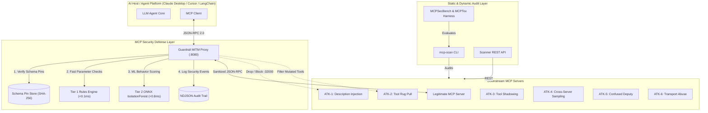
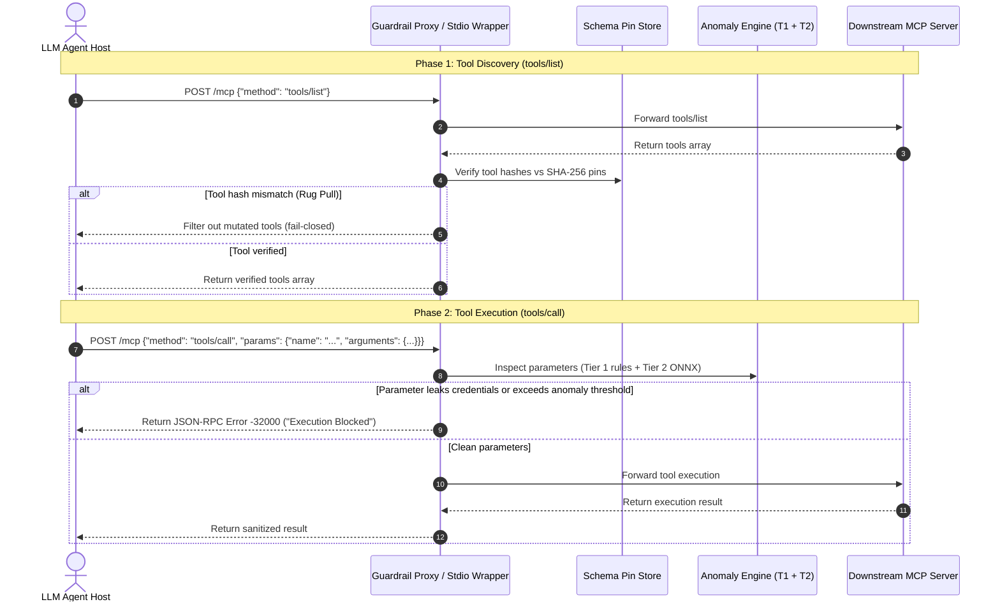

# MCP Security Red-Team & Defense Toolkit — Systems Architecture

## 1. System Overview

The **MCP Security Red-Team & Defense Toolkit** is a production-ready, open-source security engineering platform designed to audit, red-team, and defend Model Context Protocol (MCP) integrations against emerging Agentic AI attack vectors (e.g. tool description injection, dynamic rug pulls, unicode homoglyph tool shadowing, confused deputy credential exfiltration, and cross-server contamination).

---

## 2. Subsystem Architectures

### A. Common Core Engine (`packages/common/`)
Provides protocol definitions, cryptographic utilities, rule parsing, and multi-format reporting:
- **`mcp_types.py`**: Pydantic/dataclass models for JSON-RPC 2.0 MCP messages (`MCPTool`, `MCPServerCapabilities`, `Finding`, `ScanResult`, `ToolPin`, `ServerPinStore`).
- **`hash_utils.py`**: Deterministic canonical JSON serialization (`canonical_json`) with sorted keys and whitespace normalization, generating SHA-256 cryptographic pins.
- **`text_analysis.py`**: Fast regex scanning, Unicode confusable homoglyph normalization (mapping Cyrillic/Greek lookalikes to ASCII equivalents), and schema description extraction.
- **`rules_engine.py`**: Compiles YAML rule definitions (`detection-rules/static/`) into AST and regex execution trees.
- **`report.py` & `dashboard.py`**: Serializes findings into JSON, SARIF 2.1.0 (GitHub Code Scanning compliant), and standalone HTML dashboards.

---

### B. Automated MCP Scanner (`packages/scanner/`)
Connects to live or local MCP servers over STDIO subprocesses or HTTP/SSE transports:
1. **Static Analysis Phase**:
   - Inspects `tools/list` declarations, `inputSchema` property descriptions, and server capabilities.
   - Evaluates rules **S001–S010** (Instruction injection, schema poisoning, unpinned mutations, homoglyphs, credential harvesting, dangerous sampling).
   - **LLM Semantic Judge (`llm_judge.py`)**: Dispatches holistic tool catalogs to NVIDIA NIM (`deepseek-ai/deepseek-v4-flash-0731`) to detect obfuscated multi-tool prompt injections and confused deputy setups.
2. **Dynamic Behavioral Probing Phase**:
   - Executes interactive playbooks **D001–D004** via deterministic mock LLM synthesis (`mock_llm.py`).
   - Supports OAuth 2.0 Client Credentials Grant and Bearer token authentication via `AuthProvider` (`auth.py`).
   - Verifies server state transitions, TOCTOU rug-pull mutation alerts (`notifications/tools/list_changed`), and multi-server shadow collisions.
3. **Standardized Evaluation Harness (`benchmarks/`)**:
   - Integrates **MCPSecBench** (52 attack + control cases) and **MCPTox** (26 poisoned description cases).
   - Supports external community dataset ingestion via `ExternalBenchmarkLoader` (`external_loader.py`).
   - Automatically computes Precision, Recall (TPR), False Positive Rate (FPR), Accuracy, and F1 Score.

---

### C. Runtime Guardrail Proxy & Stdio Wrapper (`packages/guardrail/`)
Provides real-time, in-line defense across both network and process transports:

#### 1. Dual-Transport Architecture
- **HTTP / SSE Reverse Proxy (`proxy.py`)**: An asynchronous ASGI reverse proxy (Starlette + Uvicorn) placed between AI hosts and remote MCP servers. Exposes `/ws/events` for real-time WebSocket telemetry and `/api/stats` for live metrics.
- **Subprocess Stdio Guardrail (`stdio_wrapper.py`)**: An in-line process pipe wrapper (`mcp-guardrail stdio-wrap -- <command>`) for local CLI-spawned servers (Claude Desktop, Cursor, VS Code).

#### 2. Message Lifecycle & Inspection Pipeline

#### 3. Two-Tier Anomaly Engine
- **Tier 1 (Deterministic Rules — `<0.1ms`)**:
  - Rapid tool redefinition (<60s post-handshake).
  - High-risk credential parameter arguments (`api_key`, `token`, `password`, `ssh_key`).
  - Inbound sampling requests (`sampling/createMessage`).
  - Recursive tool call loop detection (`T1-RECURSIVE-TOOL-CALL`).
  - Cross-tool sensitive data leakage (`T1-CROSS-TOOL-DATA-LEAK`).
  - Dynamic parameter injection & shell escape sequences (`T1-UNUSUAL-PARAM-INJECTION`).
  - Configurable via `detection-rules/runtime/tier1_config.yaml`.
- **Tier 2 (Machine Learning IsolationForest on ONNX Runtime — `<0.8ms`)**:
  - Extracts 8-dimensional interaction feature vector (`[call_freq, dt, arg_count, pay_len, desc_len, is_shadowed, has_url, has_cred]`).
  - High-speed CPU ONNX inference on held-out interaction vectors.

---

### D. Vulnerable Server Lab (`packages/lab/`)
Six standalone MCP servers isolating specific vulnerability classes with `--mode safe` vs `--mode vulnerable` toggles:
- **ATK-1**: Description & Prompt Injection (CVE-2025-5277 / MCP03).
- **ATK-2**: Dynamic TOCTOU Tool Rug Pull (CVE-2025-6514 / MCP04).
- **ATK-3**: Tool Shadowing & Homoglyphs (CVE-2026-30615 / MCP06).
- **ATK-4**: Reverse Authority Sampling Abuse (CVE-2025-8821 / MCP06).
- **ATK-5**: Confused Deputy Credential Harvesting (CVE-2025-7734 / MCP01).
- **ATK-6**: Insecure Transport & Command Injection (CVE-2025-9942 / MCP05).

---

## 3. Failure Modes & Resilience (Fail-Closed)

1. **Unpinned Tools in Production Mode**:
   - When `LEARN_MODE=false`, any tool returned by a server that is missing from `.mcp-scan-pins.json` or fails SHA-256 hash validation is **dropped immediately** from `tools/list` responses.
2. **Downstream Server Unreachable**:
   - Returns standard JSON-RPC error code `-32603` (Internal Error) with clean error diagnostics.
3. **ML Model Missing / Unloadable**:
   - Falls back gracefully to Tier 1 deterministic rules with zero downtime or service interruption.
4. **WebSocket Client Disconnect**:
   - Asynchronous queue auto-pruning ensures disconnected dashboard clients do not leak memory or block proxy throughput.
